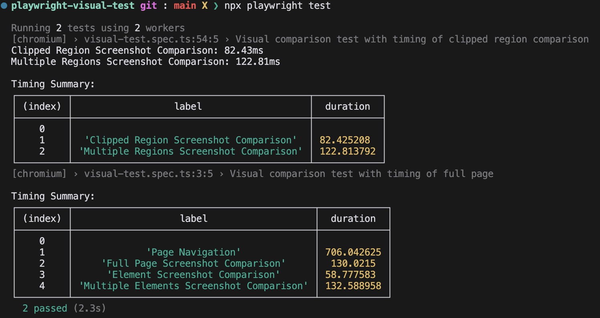

# Playwright Visual Test

## Introduction

This project demonstrates how to perform visual testing using Playwright. The example showcases a visual comparison test with timing measurements for both full page and clipped region screenshot comparisons.

## Prerequisites

- Node.js (v18.17.1)
- Playwright (v1.44.1)

## Installation

1. Clone the repository:
   ```bash
   git clone https://github.com/your-repo/playwright-visual-test.git
   ```
2. Install dependencies:
   ```bash
   npm install
   ```
3. Run the tests
   ```bash
   npx playwright test
   ```
## Runtime report



## Use decorator to measure execution time

Test file: tests/visual-test-decorator.spec.ts has a test case that uses a decorator to measure the execution timings of the test case

```typescript
@measureExecutionTime(timings)
async captureFullPage() {
            await this.page.goto('https://example.com');
            await this.page.waitForLoadState('networkidle');
            
            await expect(this.page).toHaveScreenshot('full-page.png', {
                fullPage: true,
                timeout: 10000,
                animations: 'disabled',
                mask: [this.page.locator('.dynamic-content')],
                threshold: 0.2
            });
        }
```

## Decorator function code 

```typescript
function measureExecutionTime(timings: { label: string; duration: number }[]) {
    return function (target: any, propertyKey: string, descriptor: PropertyDescriptor) { 
        const originalMethod = descriptor.value;
        descriptor.value = async function (...args: any[]) {
            const start = performance.now();
            const result = await originalMethod.apply(this, args);
            const end = performance.now();
            const duration = end - start;
            timings.push({ label: propertyKey, duration });
            return result;
        };
    };
}
```
